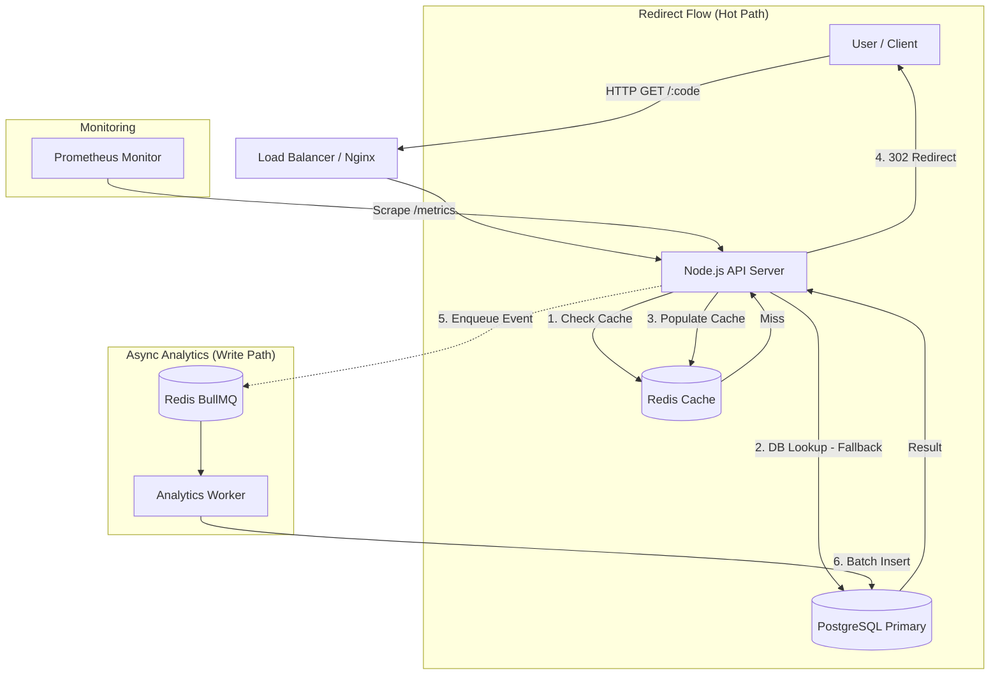

# Shorty

A high-performance URL shortening service designed for low-latency redirection and asynchronous analytics processing.

## Architecture



## Tech Stack

- **Frontend**: React 19, Vite, TailwindCSS, Zustand
- **Backend**: Node.js (Express), TypeScript
- **Database**: PostgreSQL (node-pg-migrate)
- **Caching**: Redis (ioredis)
- **Queues/Workers**: BullMQ
- **Monitoring**: Prometheus (prom-client)

## Key Features

- Multi-layer Redis caching to maintain 1-2ms redirection latency.
- Asynchronous analytics processing via BullMQ to decouple write paths from the hot path.
- Token-bucket rate limiting with fail-open design for high availability.
- PostgreSQL time-range partitioning for efficient analytics queries.
- Built-in Prometheus metrics for real-time cache, latency, and error observability.

## Run Locally

```bash
# Backend
cd backend
npm install
npm run migrate:up
npm run dev

# Analytics Worker (New Terminal)
cd backend
npm run worker

# Frontend (New Terminal)
cd frontend
npm install
npm run dev
```

## Project Structure

```text
.
├── backend/
│   ├── migrations/
│   ├── src/
│   │   ├── analytics/      # Worker and queue logic
│   │   ├── auth/           # JWT authentication
│   │   ├── infra/          # DB and Redis setup
│   │   ├── redirect/       # Hot path services
│   │   └── repositories/   # Data access layer
│   └── package.json
└── frontend/
    ├── src/
    └── package.json
```
